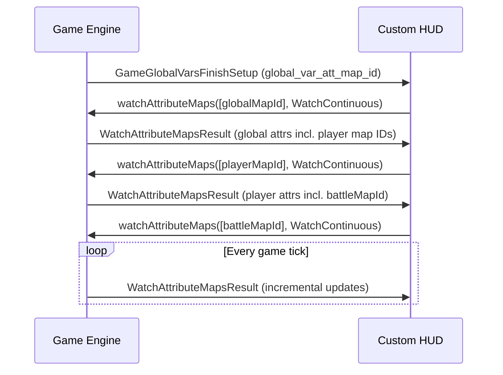

# HUD Communication API

This document describes the WebSocket protocol used between the game engine and the HUD.

## Connection

The game runs an embedded HTTP + WebSocket server.  By default the WebSocket endpoint is:

```
ws://127.0.0.1:<port>
```

The port can be discovered two ways:

1. **Embedded mode** (HUD running inside the game's CEF browser): the page is served from `http://127.0.0.1:<http_port>/`, and the WebSocket port is available at `GET /api/webserver_port` → `{ "port": 18820 }`.
2. **External dev mode**: configure the port manually (default `18820`) or read from a `debug.config.json` file.

## JSON-RPC Framing

All messages are JSON objects with a `type` field:

```typescript
// Client → Server request
{
  "type": 0,        // JSONRPCType.Request
  "id": 42,         // unique request ID
  "method": "cycleobject.watchAttributeMaps",
  "params": { ... }
}

// Server → Client response
{
  "type": 1,        // JSONRPCType.Response
  "id": 42,
  "result": { ... }
  // or "error": { "code": -32601, "message": "Method not found" }
}
```

The server can also send **requests** to the client (push notifications).  The client should respond with a `type: 1` message.

## Key Server → Client Methods

These are requests the game pushes to the HUD.  Register handlers via `bridge.onRequest()`.

### `cycleobject.GameGlobalVarsFinishSetup`

Sent once when the game session initializes.  Contains the global attribute map ID.

```json
{
  "global_var_att_map_id": 12345
}
```

**Action**: use this to start watching the global attribute map.

### `cycleobject.WatchAttributeMapsResult`

Sent whenever watched attribute maps have updated values.

```json
{
  "watch_attribute_maps_results": [
    {
      "sync_type": 1,
      "attribute_map_id": 12345,
      "attributes": {
        "80000002": 45000,
        "80000005": 1
      }
    }
  ]
}
```

**Action**: merge into your local attribute snapshots.  See [attribute-map.md](./attribute-map.md) for sync semantics.

## Key Client → Server Methods

### `cycleobject.watchAttributeMaps`

Start or stop watching attribute maps.

```json
{
  "attribute_map_ids": [12345, 67890],
  "watch_type": 1
}
```

`watch_type` values:
| Value | Name | Description |
|-------|------|-------------|
| 0 | `WatchOnce` | Get a single snapshot then stop |
| 1 | `WatchContinuous` | Receive updates until stopped |
| 2 | `StopWatch` | Stop watching these maps |

### `echo.heartbeat`

Keep-alive ping (sent by the SDK automatically).

```json
{
  "timestamp": 1714000000000
}
```

## Attribute Update Flow



## Error Codes

| Code | Meaning |
|------|---------|
| `-32601` | Method not found |
| `-32603` | Internal error |

## SDK Abstraction

The `AttributeStore` class in the SDK handles all of the above automatically.  You only need to:

```typescript
const bridge = new HUDBridge({ port: 18820 });
const store = new AttributeStore(bridge);

await bridge.connect();
store.start();

store.onChange((mapId, attributes) => {
  // React to updates
});
```
